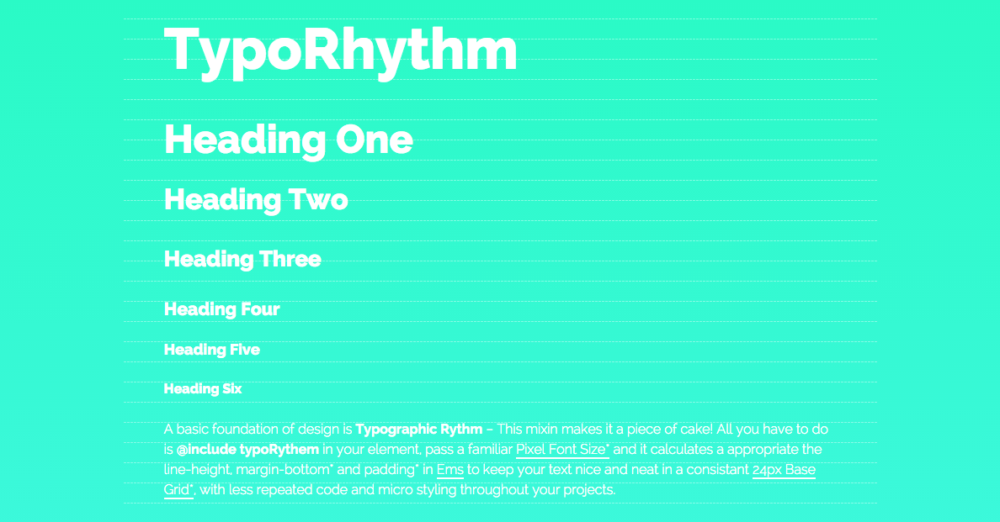

# Typography Magic!

Getting Vertical Rhythm as never been so easy! Pass `@include typoRhythm( )` in your element with a familiar pixel Font Size and it calculates the appropriate `font-size`, `line-height`, `margin-bottom` and `padding` in `rem` units.




## Installing
Available on `bower` or `npm`
```bash
$ bower install --save typorhythm
$ npm install --save typorhythm
```

## Demo
<p data-height="374" data-theme-id="14935" data-slug-hash="xbzwwx" data-default-tab="result" data-user="monteirocode" class='codepen'>See the Pen <a href='http://codepen.io/monteirocode/pen/xbzwwx/'>TypoRhythm</a> by Eddie Monteiro (<a href='http://codepen.io/monteirocode'>@monteirocode</a>) on <a href='http://codepen.io'>CodePen</a>.</p>
<script async src="//assets.codepen.io/assets/embed/ei.js"></script>

## Using
Import typoRhythm in your project
```scss
@import 'typoRhythm';
```

Start using it!
```scss
h3 {
  @include typoRhythm(21);
}
```

TypoRhythm will do the rhythmic math for you in `ems` and compile to css:
```css
h3 {
  font-size: 1.3125rem;
  line-height: 1.14286em;
}
```

Further customize your elements
```scss
h3 {
  @include typoRhythm(21, $padding: 1, $margin: 2);
}
```
```css
h3 {
  font-size: 1.3125em;
  padding: 1.14286em;
  margin-bottom: 2.28571em;
  line-height: 1.14286;
}
```

## Take control

Parameters:
- `$size` expects a `number` e.g. `14, 26, 47, 56`
- `$padding` expects a `number` e.g. `0.5, 1, 2` * `$base:24`
- `$margin` expects a `number` e.g. `0.5, 1, 2` * `$base:24`
- `$line-height` expects a `number` e.g. `0.5, 1, 2` * `$base:24`, should be left to `null`
- `$unit` expect a `string` e.g. `em, rem`

Change default base or fontsize:
```scss
$typorhythm_default_base: 24 !default;
$typorhythm_default_fontsize: 16 !default;
```

## Generator
Style multiple elements at once!

```scss
$sizeMap: ( h1:47, h2:34, h3:26, h4:21, h5:18, h6:16, p: 16, ul: 16 );

@include typoRhythmGenerator($sizeMap, $margin: 1);
```
```css
h1 {
  font-size: 2.9375rem;
  margin-bottom: 0.51064em;
  line-height: 1.02128;
}

h2 {
  font-size: 2.125rem;
  margin-bottom: 0.70588em;
  line-height: 1.41176;
}

h3 {
  font-size: 1.625rem;
  margin-bottom: 0.92308em;
  line-height: 1.84615;
}

/*
...
...
You get the gist!
*/
```

Keep the Rhythm going!
